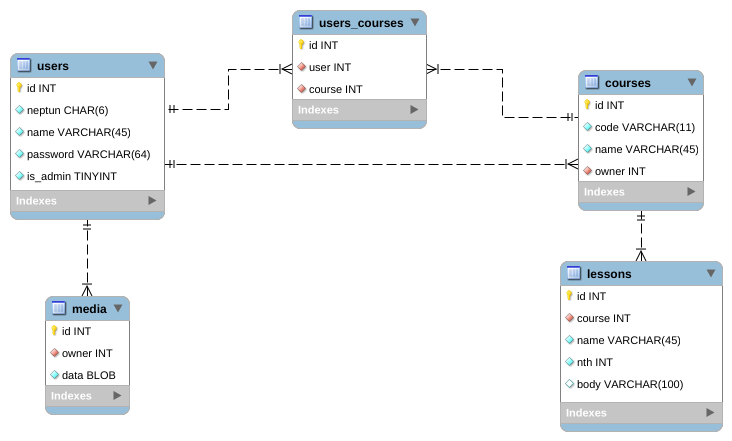

# Rendszerterv
## 1. A rendszer célja

## 2. Projektterv

### 2.1 Projektszerepkörök, felelőségek:
     
### 2.2 Projektmunkások és felelőségek:
     
### 2.3 Ütemterv:

### 2.4 Mérföldkövek:

## 3. Üzleti folyamatok modellje

### 3.1 Üzleti szereplők

### 3.2 Üzleti folyamatok

## 4. Követelmények

### 4.1 Funkcionális követelmények

### 4.2 Nemfunkcionális követelmények
| Id | Modul | Név | Leírás |
| :---: | --- | --- | --- |
| F1 | Bejelentkeztető | Bejelentkeztető | bejelentkezést kezelő kód |
| F2 | Bejelentkeztető | Bejelentkezési lap | bejelentkezésre szolgáló űrlap |
| F3 | Bejelentkeztető | Bejelentkezés ellenörző | felhasználó oldali bejlentkezési űrlap hitelesítő |
| F4 | Regisztrációs | Regisztrálás kezelő | regisztrációt kezelő kód |
| F5 | Regisztrációs | Regisztálási lap | regisztrációra szolgáló űrlap |
| F6 | Regisztrációs | Regisztálás ellenörző | felhasználó oldali regisztrációs űrlap hitelesítő |
| F7 | Kurzus lista | Kurzus lista | minden kurzus listája |
| F8 | Kurzus lista | Kurzus szűrő | kurzus lista szűrésére szolgáló kód |
| F10 | Kurzus felvétel | Kurzus jelentkező | kurzusra való pangó jelentkezést kezelő kód |
| F11 | Kurzus felvétel | Jelentkezés lista | oldal ami felsorolja a felhasználó álltal birtokolt kurzusokra szóló, pangó jelentkezéseket |
| F12 | Kurzus megtekintés | Kurzus lap | kurzus lapja |
| F13 | Kurzus megtekintés | Óra lap | egy kurzushoz tartozó önálló órák lapjai |
| F14 | Kurzus készítő | Kurzus készítő | kurzus létrehozására szolgáló menüpont |
| F15 | Kurzus szerkesztő | Kurzus szerkesztő | kurzus feltöltésére szolgáló lap |
| F15 | Kurzus szerkesztő | Kurzus feltöltő | kurzus feltoltésére szolgáló kód |

### 4.2 Nemfunkcionális követelmények

| ID | Megnevezés | Leírás |
| --- | --- | --- |
| K1 | UI | Az elvárás a felület modern kialakítása és könnyű navigálhatósága a mai kor igényeinek megfelelően |
| K2 | Tulajdon kezelés | Kurzus tulajdonos megkülönböztetése |
| K3 | Felhasználó kezelés | Felhasználói fiók létrehozása, adatok tárolása |

### 4.3 Támogatott eszközök
A támogatott eszközök magukba foglalják a modern webböngészőket, mint például a Google Chrome, Firefox és Safari, valamint azokat az eszközöket, amelyek rendelkeznek beépített webböngészővel és interneteléréssel.

## 5. Funkcionális terv

### 5.1 Rendszerszereplők

### 5.2 Menühierarchiák

## 6. Fizikai környezet

### 6.1 Hardver topológia

### 6.2 Fejlesztő eszközök

## 7. Architekturális terv

### 7.1 Webszerver

### 7.2 Adatbázis rendszer

MySql relációs adatbázis.

## 8. Adatbázis terv

Lásd: media/elearning.mwb. 

## 9. Implementációs terv

## 10. Telepítési terv

## 11. Karbantartási terv
